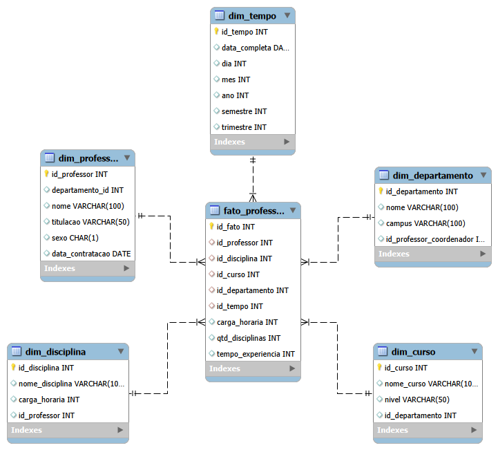

# Projeto de Modelagem Dimensional

## Objetivo

Este projeto tem como objetivo a criação de um modelo dimensional no formato **Star Schema**, com foco na análise de dados relacionados aos professores de uma universidade.

A modelagem foi desenvolvida com base em um esquema relacional previamente fornecido, sendo adaptada para um contexto analítico (Data Warehouse).

---

## Contexto da Análise

O foco principal da análise é o **professor**, considerando:

* Disciplinas ministradas
* Cursos associados
* Departamento ao qual pertence
* Informações temporais relacionadas às ofertas

**Observação:** Dados de alunos não foram considerados, conforme especificação do desafio.

---

## Modelo Dimensional (Star Schema)

O modelo foi estruturado utilizando:

* **1 Tabela Fato**
* **5 Tabelas Dimensão**

---

## Tabela Fato

### `fato_professor`

Armazena os dados quantitativos e relacionamentos principais do modelo.

**Chaves estrangeiras:**

* id_professor
* id_disciplina
* id_curso
* id_departamento
* id_tempo

**Métricas:**

* carga_horaria
* qtd_disciplinas
* tempo_experiencia

**Granularidade:**

> Cada registro representa um professor ministrando uma disciplina em um curso em um determinado período.

---

## Tabelas Dimensão

### `dim_professor`

Contém informações descritivas dos professores:

* nome
* titulação
* data de contratação
* departamento

---

### `dim_departamento`

Informações sobre os departamentos:

* nome
* campus
* professor coordenador

---

### `dim_curso`

Dados dos cursos:

* nome do curso
* nível
* departamento associado

---

### `dim_disciplina`

Detalhes das disciplinas:

* nome da disciplina
* carga horária
* professor responsável

---

### `dim_tempo`

Dimensão criada para análise temporal:

* data completa
* dia, mês, ano
* semestre
* trimestre

---

